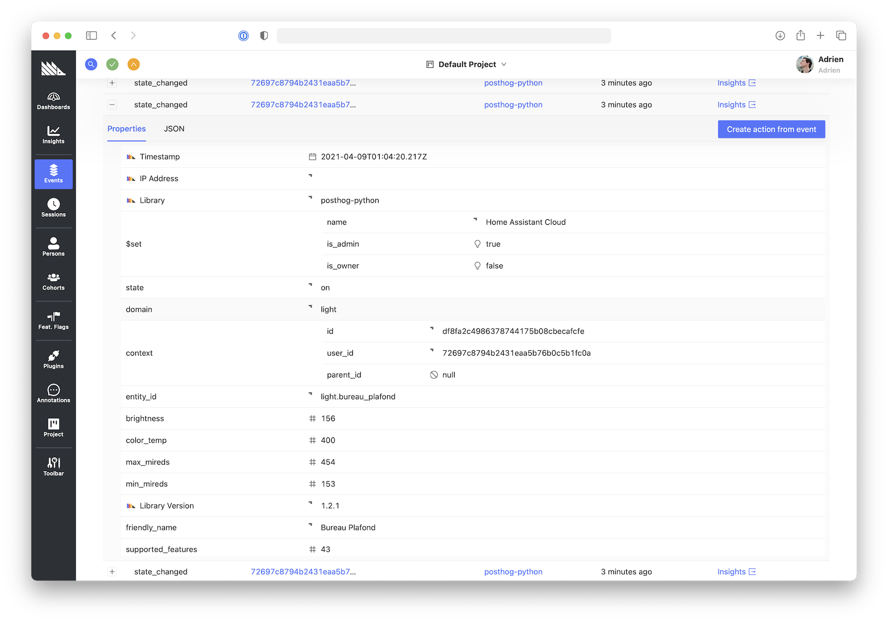

# Posthog for Home Assistant

This integration will forward home assistant state change events to [PostHog](https://posthog.com).

When applicable, the integration will set the `name` user property.
For example, when turning off a light using alexa/google-assistant
through [home assistant cloud](https://www.nabucasa.com), the event will be linked
to the `Home Assistant Cloud` user/person.



## Installation

[HACS](https://hacs.xyz) is the recommended way to install this integration.
Add `https://github.com/adrienbrault/ha-posthog` as a [custom repository](https://hacs.xyz/docs/faq/custom_repositories/).

You'll need to update your `configuration.yaml`:
```yaml
posthog:
  api_key: !secret posthog_api_key
  host: 'https://app.posthog.com' # You can remove this line if you're using app.posthog.com
```

## Notes

Generated using:

```
docker run \
    -it --rm -v $PWD:/app -w /app \
    python:3.8-alpine \
    sh -c 'apk add git ; pip install cookiecutter ; cookiecutter https://github.com/boralyl/cookiecutter-homeassistant-component ; ls -lh'
```
